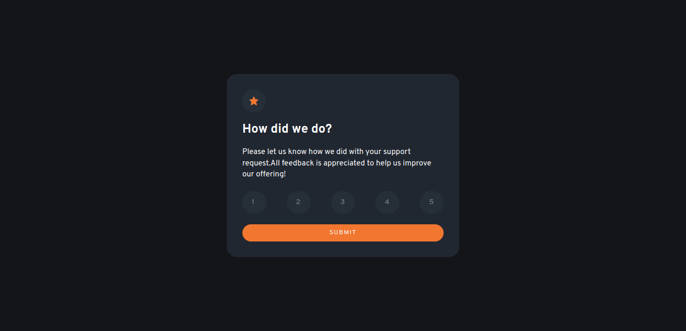

# Frontend Mentor - Interactive rating component solution

This is a solution to the [Interactive rating component challenge on Frontend Mentor](https://www.frontendmentor.io/challenges/interactive-rating-component-koxpeBUmI). Frontend Mentor challenges help you improve your coding skills by building realistic projects. 

## Table of contents

- [Overview](#overview)
  - [The challenge](#the-challenge)
  - [Screenshot](#screenshot)
  - [Links](#links)
- [My process](#my-process)
  - [Built with](#built-with)
  - [What I learned](#what-i-learned)
  - [Continued development](#continued-development)
  - [Useful resources](#useful-resources)
- [Author](#author)


## Overview
Interactive rating component challenge, involves recreating a rating card, that allows you to rate and submit value. On submission, it forwards you to the thank you page, showcasing you rating and thanking you for your services.

### The challenge

Users should be able to:

- View the optimal layout for the app depending on their device's screen size
- See hover states for all interactive elements on the page
- Select and submit a number rating
- See the "Thank you" card state after submitting a rating

### Screenshot



### Links

- Solution URL: [Add solution URL here](https://your-solution-url.com)
- Live Site URL: [Add live site URL here](https://your-live-site-url.com)

## My process
- I started the challenging by typing in my html code, then I wrote the css styling.
- On the css, i used media queries to create responsiveness in my page.
- Lastly, I went on to write javascript code, which entails functionality for user interaction such as shifting to the next page after submission.

### Built with

- Semantic HTML5 markup
- CSS custom properties
- Javascript - for the functionality
- Mobile-first workflow

### What I learned

Some of my major learnings while working through this project.

To see how you can add code snippets, see below:

``` css
:root{
  --values
}
```
```js
//- forEach is used with querySelectorAll.
btnRate.forEach((button) =>{
  //code
})
//- addEventListener has 2 arguments passed to it.
button.addEventListener("click", () =>{
     //code
  })

```

### Continued development

In this project, i have learned the **forEach keyword** and would like to refine it and practice is even in my next challenges. 
I also learned the concept of **childNodes** and how one is able to target children in an element.


### Useful resources

- [childNodes](https://stackoverflow.com/questions/24596091/javascript-targeting-child-elements-in-a-id) - This helped me with the concept of targetting childNodes. I really liked this concept and will use it going forward.
- [active class](https://www.google.com/search?q=how+to+add+class+active+button+in+js&oq=how+to+add+class+active+button+in+js&aqs=chrome..69i57j0i546l5.38760j1j7&sourceid=chrome&ie=UTF-8#kpvalbx=_aqqcYvqIJJ2Gxc8PnIOIuAw16) - This video helped me understand how to add classList. In this case, how to add the ".btn-active" to my rate buttons.I'd recommend it to anyone still learning this concept.


## Author

- Website - [Add your name here](https://www.your-site.com)
- Frontend Mentor - [@Lesley-w19](https://www.frontendmentor.io/profile/Lesley-w19)
- Twitter - [@lesley_wanjiku](https://twitter.com/lesley_wanjiku)
- LinkedIn - [Lesley Wanjiku](https://www.linkedin.com/in/lesley-wanjiku)


